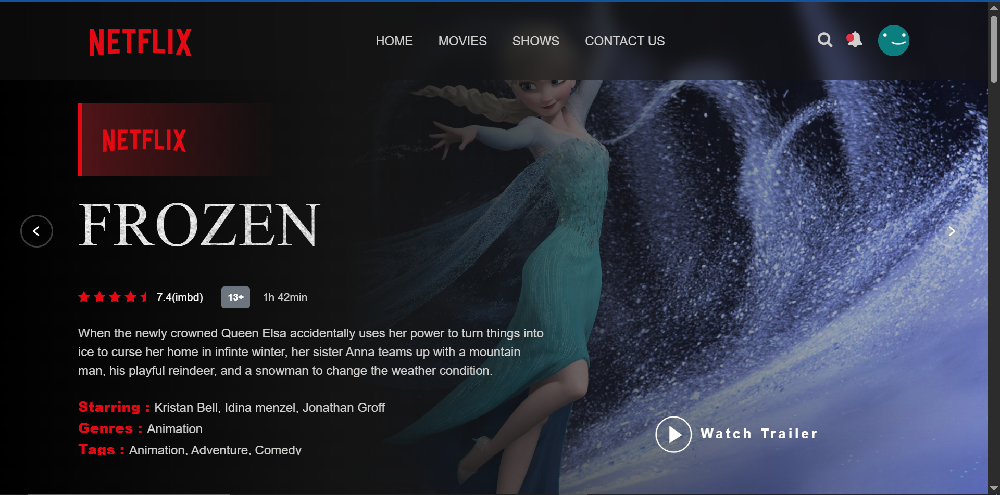
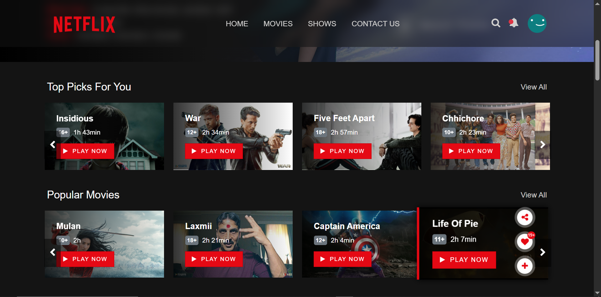
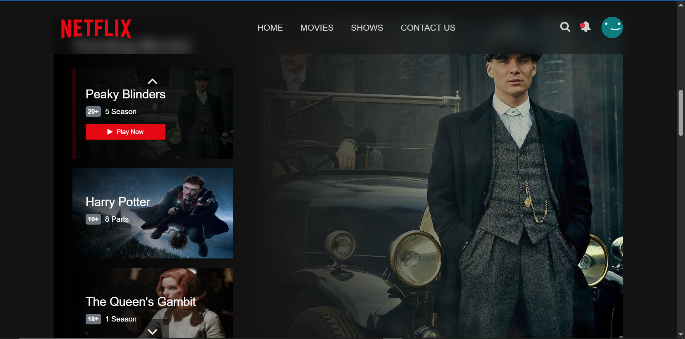
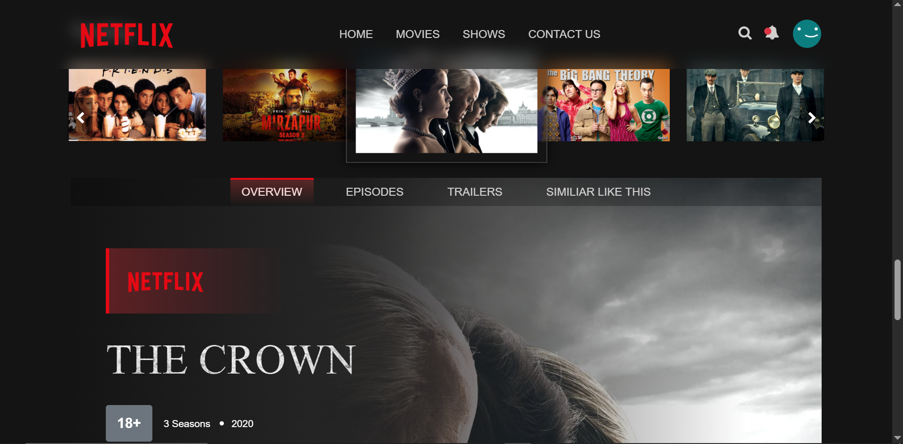
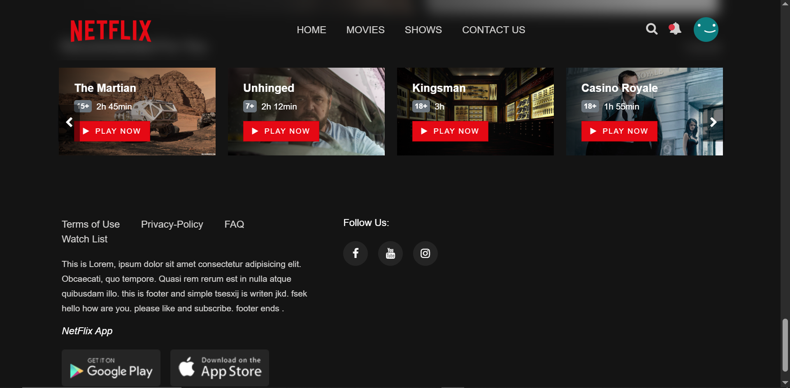

📽️ Movies OTT Platform

A simple front-end only static Movies/OTT platform built with HTML, CSS, and JavaScript.
This project appears to be a client-side app showcasing movies or video content in a responsive layout.

🚀 Features

🎬 Home page UI for browsing movies/videos

📺 Embedded video previews or demo content

🖼️ Gallery of movie thumbnails or images

📱 Responsive layout with CSS & JavaScript

📦 No backend server — purely static

🧱 Tech Stack

HTML5 – Structure

CSS3 – Styling

JavaScript – Interactivity

Static assets – Images, videos, etc.

📁 Project Structure
Movies-ott-platform/
├── css/
│   └── style.css
├── images/
├── js/
│   └── main.js
├── video/
├── index.html
└── README.md

🛠️ How to Run It Locally

Clone the repository

git clone https://github.com/sarthak291/Movies-ott-platform.git

Open index.html in your browser

Double-click the file

or serve it with a simple HTTP server:

npx http-server

📌 Notes

This project does not include backend functionality like user auth or database.

You can enhance it by fetching real movie data from APIs (e.g., TMDB).

🆕 Ideas for Improvement

✨ Add API integration (TMDB/OMDb)
✨ Add search and filter
✨ Add watchlist feature
✨ Convert to a React/Vue app

screenshots:

